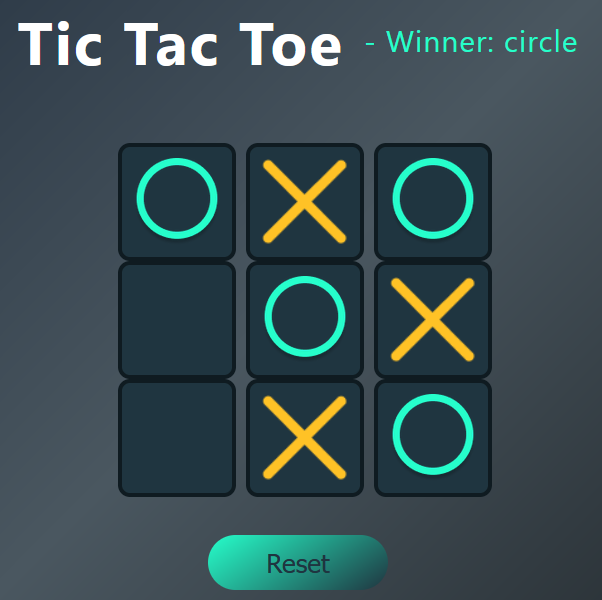

# 🎮 Tic-Tac-Toe Game - React

Welcome to the **Tic-Tac-Toe Game** built with **React**! ✨  
A fun and interactive game where you can challenge yourself or play against a friend. It's fully responsive, beautifully designed, and easy to play.

## 🌟 Features:
- **Interactive Gameplay**: Play as "X" or "O" and try to win by aligning your marks in a row, column, or diagonal.
- **Responsive Design**: Works seamlessly on both desktop and mobile devices.
- **Real-time Winner & Tie Detection**: Instantly shows the winner or a tie when the game ends.
- **Modern UI**: Clean design with smooth animations and a visually appealing interface.
- **Game Reset**: Quickly reset the game when it's over to start a new round.

## 💻 Tech Stack:
- **Frontend**: React
- **Styling**: Custom CSS for a smooth, modern UI
- **Build Tool**: Vite

## 📁 Project Structure:


tic-tac-toe ├── node_modules ├── public │ └── react.svg ├── src │ ├── assets │ │ ├── circle.png │ │ └── cross.png │ ├── components │ │ └── TicTacToe │ │ ├── TicTacToe.jsx │ │ └── TicTacToe.css │ ├── App.css │ ├── App.jsx │ ├── index.css │ ├── main.jsx ├── .gitignore ├── eslint.config.js ├── index.html ├── package-lock.json ├── package.json ├── README.md └── vite.config.js


## 🚀 Installation & Setup:

1. Clone this repository to your local machine:

    ```bash
    git clone https://github.com/your-username/tic-tac-toe-react.git
    cd tic-tac-toe-react
    ```

2. Install the required dependencies:

    ```bash
    npm install
    ```

3. Run the development server:

    ```bash
    npm run dev
    ```

4. Open your browser and go to `http://localhost:3000` to start playing the game!

## 📸 Screenshots:
Here’s a preview of the game in action:




## 🎮 How to Play:
- **Click** on an empty square to place your mark (circle or cross).
- The game alternates between "X" and "O".
- The first player to align three of their marks horizontally, vertically, or diagonally wins.
- If the board is full and there’s no winner, it’s a tie.
- Press the **Reset** button to start a new game.

## 🌍 Live Demo:
Check out the live version of the game [here](https://ahsanlaeeq.github.io/Tic-Tac-Toe/).

## 🚀 Future Enhancements:
- Add a multiplayer mode (local or online).
- Implement AI with difficulty levels (easy, medium, hard).
- Improve animations and transitions for a smoother experience.

## 🤝 Contributing:
1. Fork the repository.
2. Create a new branch (`git checkout -b feature/your-feature`).
3. Make your changes and commit them (`git commit -am 'Add your feature'`).
4. Push to your branch (`git push origin feature/your-feature`).
5. Create a new Pull Request.

## 📝 License:
This project is licensed under the MIT License - see the [LICENSE](LICENSE) file for details.

---

### 👤 Created by [Ahsan Laeeq](https://www.linkedin.com/public-profile/settings?trk=d_flagship3_profile_self_view_public_profile)

- LinkedIn: [Ahsan Laeeq](https://www.linkedin.com/in/ahsanlaeeq/)
- GitHub: [Ahsan Laeeq](https://github.com/AhsanLaeeq)

---

Thank you for checking out my project! Feel free to contribute, star the repo, or provide feedback! 🚀
